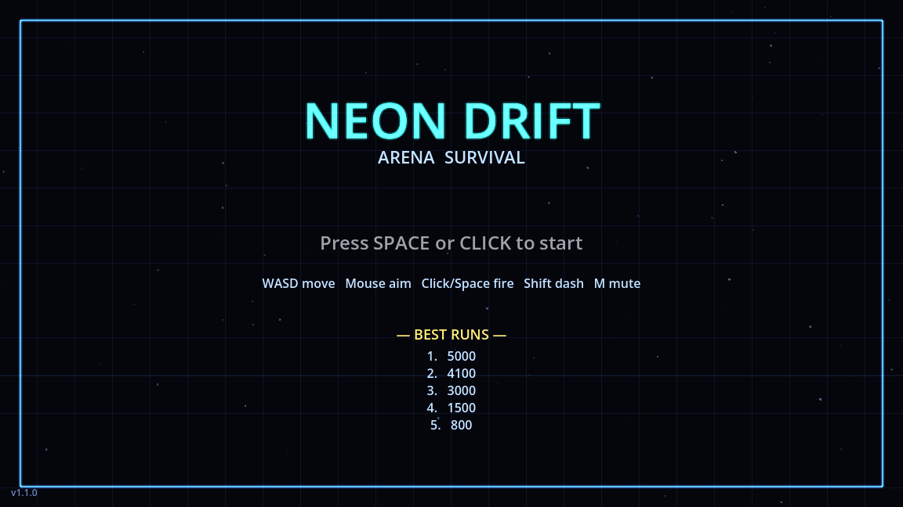
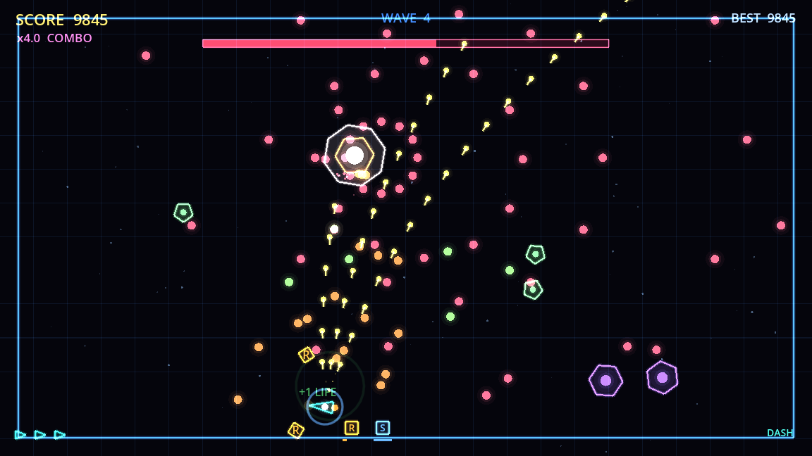
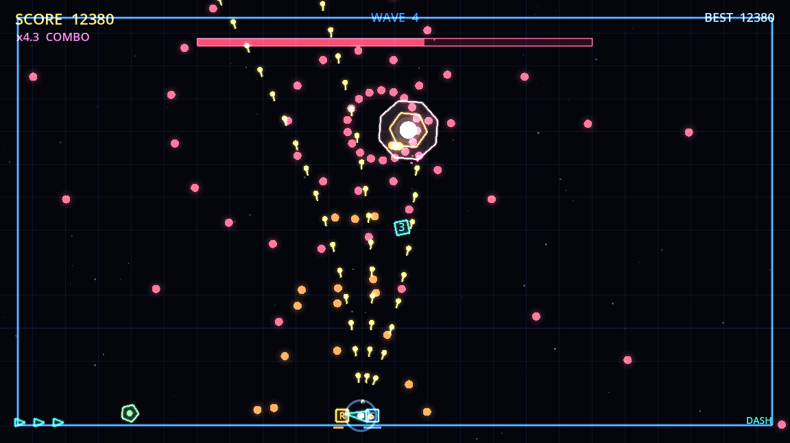

# Neon Drift

A small, polished **neon arena survival shooter** built in **Godot 4.6 / GDScript**.
Top-down twin-stick feel: move, aim with the mouse, shoot, dash, and survive an
accelerating swarm punctuated by bullet-hell bosses. Everything is drawn in code —
no external art — and every sound (plus the looping music) is generated
procedurally. Native, self-contained, exe-ready.





## Controls

| Action | Keys |
| ------ | ---- |
| Move   | `WASD` or arrow keys |
| Aim    | Mouse |
| Fire   | Left mouse button or `Space` (hold to auto-fire) |
| Dash   | `Shift` — i-frames + rams enemies (off a short cooldown) |
| Pause  | `Esc` (in game) |
| Mute   | `M` |
| Start / Restart | `Space` / `Enter` / Left click |
| Quit   | `Esc` in the menu · `Q` from the pause screen |

## What's in it

- **Four enemy archetypes** — chaser, fast darter, tanky brute, and a ranged
  spitter that keeps its distance and shoots back.
- **Bosses** every 3 waves: a health bar, two phases (it enrages at 50%), radial +
  aimed bullet patterns, and minion spawns.
- **Power-ups** dropped by enemies (and always by bosses): Rapid fire, Spread shot,
  Shield, Bomb (screen clear), and +1 Life — with on-screen buff timers.
- **Dash** with brief invulnerability that also rams through enemies.
- **Combo multiplier** — chain kills to scale your score up to ×5.
- **Local top-5 leaderboard** persisted to `user://neon_drift.save`.
- **Juice**: screen shake, hit-stop, particles + shockwave rings, score popups,
  additive neon glow, drifting starfield, and a procedural music loop.
- 3 lives with i-frames + knockback; spawn rate and enemy speed ramp over time.

## Run it

Requires Godot **4.6+** (no extra dependencies).

```bash
godot --path .                       # run the game
# or open the folder in the Godot editor and press F5
```

On macOS the engine binary is inside the app bundle:
`/Applications/Godot.app/Contents/MacOS/Godot`.

## Regenerate the sounds + music

The WAVs in `sfx/` are produced by a pure-stdlib Python script (no numpy):

```bash
python3 gen_sfx.py
```

## Verify (headless)

`verify.sh` regenerates SFX, imports assets, runs the game headless for a few hundred
frames, and fails on any script/load error **or resource leak**:

```bash
./verify.sh
# -> VERIFY: PASSED — project loaded and ran headless with no script/load errors or leaks.
```

## Build a Windows .exe

The Windows Desktop export preset is in `export_presets.cfg`. Install the Godot
**export templates** for your engine version once (Editor → *Manage Export
Templates*, or drop the official `.tpz` into the templates folder), then:

```bash
godot --headless --export-release "Windows Desktop" build/windows/NeonDrift.exe
```

Output: a standalone `NeonDrift.exe` + `NeonDrift.pck` (flip
`binary_format/embed_pck` to `true` in the preset for a single file).

> **Icon note:** `icon.ico` is generated and wired into the preset. Godot embeds it
> into the `.exe` via `rcedit`, which only runs on Windows (or via `rcedit`+`wine`
> configured in the editor). Exporting from macOS/Linux skips the PE-icon rewrite,
> so the static Explorer/taskbar icon stays default until you export from Windows;
> the in-engine window icon (`icon.svg`) is correct either way.

## Project layout

```
project.godot         Engine config (1152×648, GL Compatibility renderer)
main.tscn             One Node2D root -> main.gd
main.gd               The entire game (state machine, entities, render, audio, save)
gen_sfx.py            Procedural SFX + music generator (stdlib only)
sfx/*.wav             Generated sound effects + music loop
icon.svg / icon.ico   Vector window icon / Windows exe icon
export_presets.cfg    Windows Desktop export preset
verify.sh             Headless smoke test
tools/                Dev-only screenshot tool (.gdignore'd — kept out of the .pck)
screenshots/          Captured frames (.gdignore'd — repo only, not shipped)
```

## Design notes

Deliberately robust and portable — a single script, one node:

- **Entities** (bullets / enemies / enemy bullets / particles / popups / power-ups)
  are plain `Array`s of `Dictionary`s, updated in `_process`, drawn in `_draw`.
- **Collisions** are manual circle-vs-circle distance checks — no physics bodies,
  no `Area2D`, no signals.
- **Input** is polled directly (`Input.is_key_pressed`, mouse position) — no
  dependency on the project's input map.
- **Text** uses `ThemeDB.fallback_font`; **shake** is applied via
  `draw_set_transform` (draw-space only, so world/input coords stay clean).
- **Neon glow** is faked cheaply with additive blending + low-alpha layered passes.
- The save loader length- and range-checks every value, so a corrupt/edited save
  can never overflow or poison the high score.

Tuning constants live at the top of `main.gd` (player speed, fire rate, bullet
speed, dash, buff durations, spawn ramp, boss cadence, enemy archetypes).

## Shipping to Steam (publisher checklist)

1. Install export templates and produce the `.exe` (above). Test on Windows.
2. (Optional) Integrate **GodotSteam** for achievements / cloud saves.
3. Create a Steamworks account and pay the **Steam Direct** fee (≈ $100/title —
   confirm the current amount).
4. Build the store page + capsule art, pass review, then upload with **SteamPipe**
   (`steamcmd`) and publish.

## License

You own this code — ship it.
